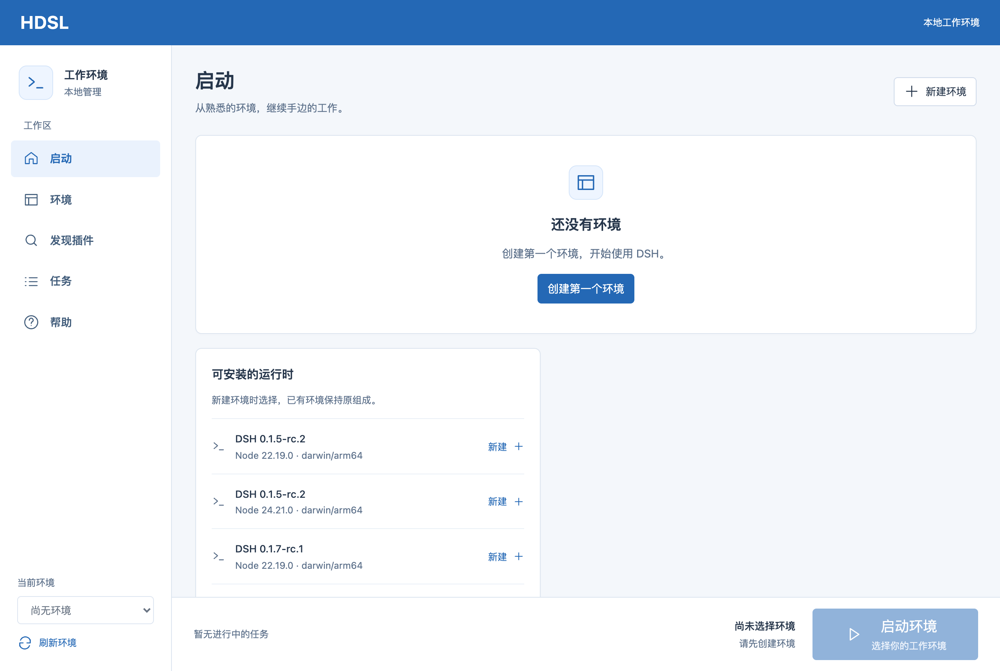
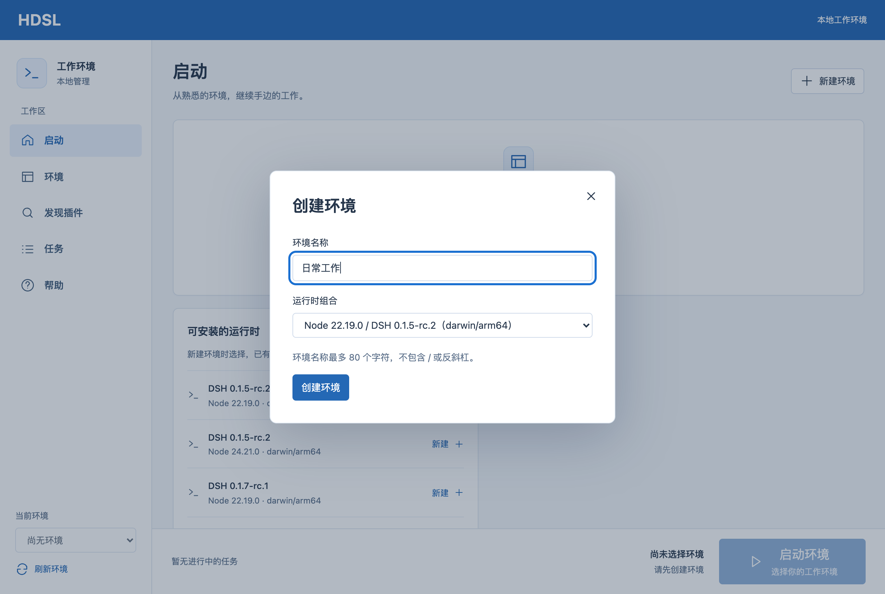

# HDSL

**你的 DSH，从这里开始。**

为 DeepSeek Harness 管理环境、版本与插件的桌面启动器。

**简体中文** · [English](README.en.md)

[下载体验版](https://github.com/YingkeSu/HDSL/releases) · [使用指南](docs/user-guide.md) · [反馈问题](https://github.com/YingkeSu/HDSL/issues)

---

从一个窗口开始，管理你的本地 DSH 工作环境。

## 把准备工作交给 HDSL

想试一个新插件，又不想打乱正在使用的配置？想为不同项目保留各自的工作环境？HDSL 把这些准备工作放进一个桌面窗口，让你更方便地开始使用 DSH。

- **各自独立的环境** — 为不同工作创建环境，分别保存配置与运行数据，随时切换。
- **自动准备运行环境** — 选择已支持的版本，下载与安装由 HDSL 完成，无需手动配置运行工具。
- **启动、停止，一眼看清** — 查看运行状态与操作进度，启动后在浏览器中进入 DSH。
- **按需管理插件** — 查找插件，预览安装内容，安装或移除扩展；需要重启时会提示你。
- **尝试新版本，保留旧组成** — 切换已支持的 DSH 版本，也能恢复此前的版本与插件组成。
- **遇到问题有迹可循** — 查看错误与恢复状态，导出经过脱敏的诊断信息，方便反馈。

*应用实拍：macOS 上的中文界面，使用全新临时配置；示例名称为「日常工作」。*

## 下载与安装

前往 **[GitHub Releases](https://github.com/YingkeSu/HDSL/releases)**，展开对应版本的 **Assets**，选择适合你的安装包。无需下载源码。

| 你的电脑 | 下载文件 | 使用范围 |
| --- | --- | --- |
| Mac，Apple 芯片（M 系列） | `HDSL-…-mac-arm64.dmg` | 当前主要体验平台 |
| Windows，64 位 Intel / AMD | `HDSL-…-win-x64-…-setup.exe`（安装器，随 Windows 安装器打包提供）或 `HDSL-…-win-x64-…-portable.zip`（便携） | 界面预览；暂不能创建、安装或运行 DSH 环境 |
| Intel Mac、Windows ARM、Linux | 暂无 | 尚未支持 |

**这是早期体验版。** Mac 包未经过 Apple Developer ID 签名与公证，Windows 包也未签名；系统可能提示无法验证开发者。Windows 尚未经过实机使用验收。每次发布的具体情况以 Release 说明为准。本次新增的 macOS `.dmg` 与 Windows 安装器 `.exe` 资产从包含对应打包变更的下一次发布起提供；此前的 Release 尚无这些资产。

Mac：打开下载的 `.dmg`，把 `HDSL.app` 拖到「应用程序」，再推出磁盘映像（同版本的 `.zip` 为备用解包产物）。Windows：双击 `…-setup.exe` 安装器安装（未签名，SmartScreen 可能提示），或完整解压便携 ZIP 后打开 `HDSL.exe`，保留旁边的文件。

## 第一次使用

1. 打开 HDSL，创建一个环境，为它起个容易辨认的名字。
2. 选择已支持的版本，等待自动下载与安装；首次使用需要网络。
3. 按[使用指南](docs/user-guide.md)配置 API 密钥。目前这一步仍需通过 macOS 钥匙串完成。
4. 启动环境，打开浏览器中的 DSH 工作界面，开始使用。

之后，你可以为另一项工作创建新环境，或在现有环境中管理插件、切换版本。

## 试用前了解这些

- 当前 Mac 环境支持 DSH `0.1.5-rc.2` 与 `0.1.7-rc.1`。列表中能看到的其他上游版本，未必可以安装。
- 恢复旧版本与插件组成**不会撤销文件或会话数据的变化**，重要数据请另行备份。
- 环境分开存放，但插件仍可能访问环境外的文件，请只安装你信任的插件。
- 保存插件配置后，可能需要重启才能生效；HDSL 不能保证所有第三方插件都可正常使用。
- 整合包分享尚未提供。

## 帮助与反馈

遇到问题，请在 [Issues](https://github.com/YingkeSu/HDSL/issues) 描述你的系统、操作步骤和看到的提示。附图前请遮住密钥和私人信息。

想参与开发？从[贡献指南](CONTRIBUTING.md)和[开发文档](docs/README.md)开始。

使用与分发条件见 [LICENSE](LICENSE)，第三方组件说明见 [THIRD_PARTY_NOTICES.md](THIRD_PARTY_NOTICES.md)。
