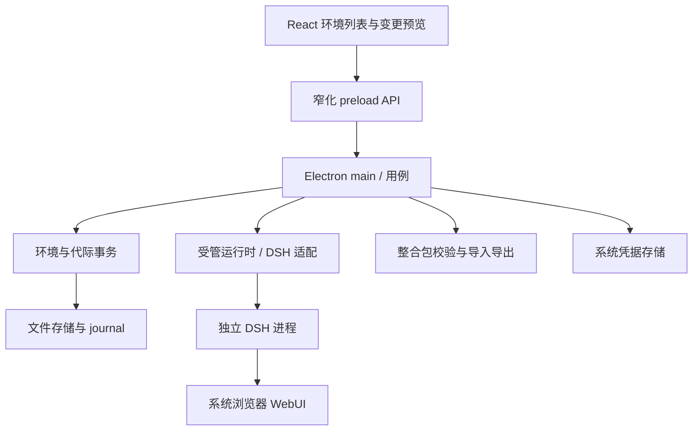
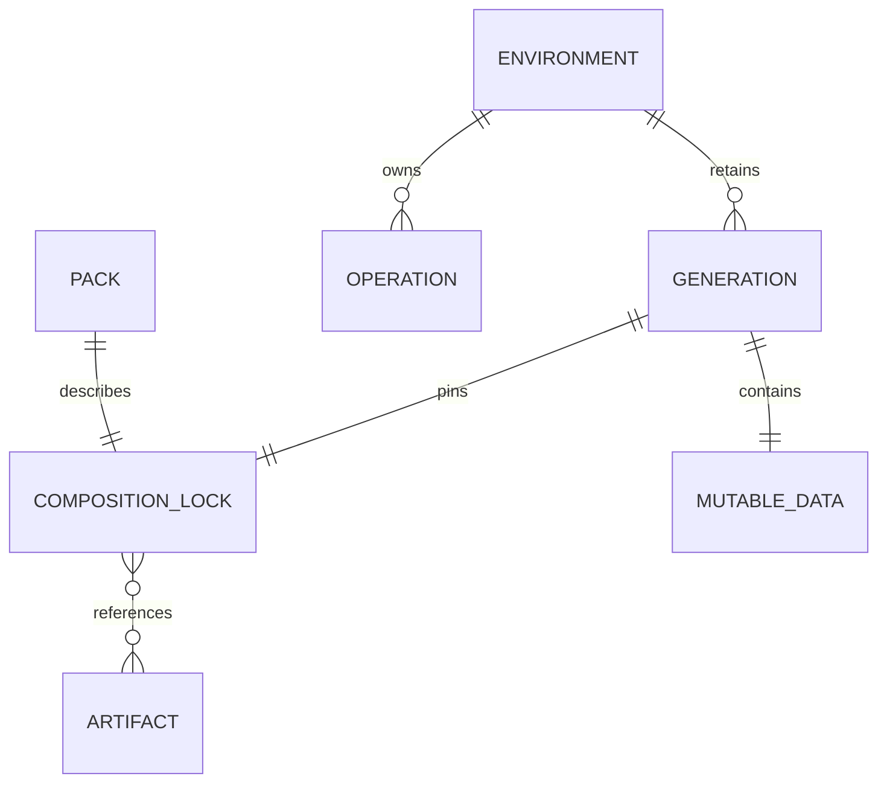
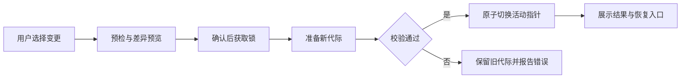
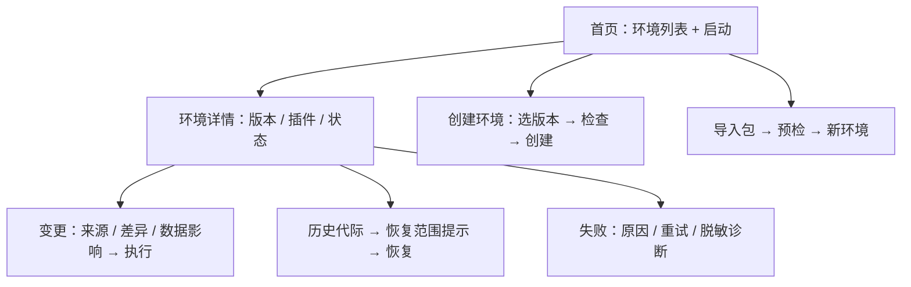

# 架构、概念与流程

以下为本次整理的可编辑概念图，非已实现 UI 或原附件图稿。

## 模块架构

```mermaid
flowchart TB
  UI[React 环境列表与变更预览] --> Bridge[窄化 preload API]
  Bridge --> App[Electron main / 用例]
  App --> Core[环境与代际事务]
  App --> Runtime[受管运行时 / DSH 适配]
  App --> Pack[整合包校验与导入导出]
  Core --> Store[文件存储与 journal]
  Runtime --> Child[独立 DSH 进程]
  App --> Credentials[系统凭据存储]
  Child --> Browser[系统浏览器 WebUI]
```

## 概念关系

```mermaid
erDiagram
  ENVIRONMENT ||--o{ GENERATION : retains
  ENVIRONMENT ||--o{ OPERATION : owns
  GENERATION ||--|| COMPOSITION_LOCK : pins
  COMPOSITION_LOCK }o--o{ ARTIFACT : references
  GENERATION ||--|| MUTABLE_DATA : contains
  PACK ||--|| COMPOSITION_LOCK : describes
```

## 变更流程

```mermaid
flowchart LR
  A[用户选择变更] --> B[预检与差异预览]
  B --> C[确认后获取锁]
  C --> D[准备新代际]
  D --> E{校验通过}
  E -->|是| F[原子切换活动指针]
  E -->|否| G[保留旧代际并报告错误]
  F --> H[展示结果与恢复入口]
```

## UI 信息层次

```mermaid
flowchart TD
  Home[首页：环境列表 + 启动] --> Detail[环境详情：版本 / 插件 / 状态]
  Home --> Create[创建环境：选版本 → 检查 → 创建]
  Detail --> Change[变更：来源 / 差异 / 数据影响 → 执行]
  Detail --> Recovery[历史代际 → 恢复范围提示 → 恢复]
  Home --> Import[导入包 → 预检 → 新环境]
  Detail --> Error[失败：原因 / 重试 / 脱敏诊断]
```
